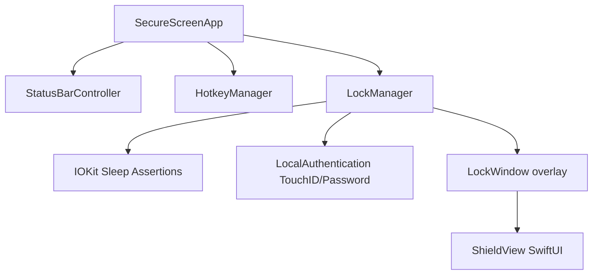

# SecureScreen Implementation Plan

SecureScreen is a utility plugin/application for macOS designed to lock the user's screen (displaying a secure, customizable translucent overlay) while preventing the system from going to sleep. This ensures that long-running background tasks—such as code compilation (e.g., Gradle builds) or autonomous AI agent runs—continue executing at full speed while the device is secured against nosy neighbors.

## User Review Required

> [!IMPORTANT]
> **Accessibility Permission Required (REVISED)**:
> The Codex prototype revealed that kiosk mode options alone do not block trackpad gestures (space switching), Spotlight (Cmd+Space), or Dock clicks. Full input blocking requires a **CGEventTap** at `cgAnnotatedSessionEventTap`, which macOS gates behind Accessibility permission. The app will prompt for this at launch and refuse to lock if it is not granted.
>
> **Global Shortcut Integration**:
> **Lock** (⌥⇧L) is registered via Carbon HotKey API (no extra permissions). **Unlock** (⌥⇧U) is handled inside the CGEventTap callback — Carbon is not used for unlock because the event tap consumes events before Carbon sees them when locked.

> [!IMPORTANT]
> **Known Issues Fixed in This Revision**:
> - Codex unlock failure → EventBlocker now calls `pauseForAuth()` before `LAContext.evaluatePolicy`, allowing keyboard through for password entry.
> - Codex overlay as centered panel → `LockWindow.frame = screen.frame` (full `NSScreen.frame`, not `visibleFrame`), covers dock and menu bar area.
> - Codex trackpad/Spotlight/Dock not blocked → CGEventTap blocks `.keyDown`, `.scrollWheel`, and mouse events at session level; kiosk options block Cmd+Tab and Cmd+Opt+Esc.
> - Codex status bar icon not interactable while locked → `LockWindow.ignoresMouseEvents = true` (window is visual only); EventBlocker allowlists `statusItemScreenRect` so the shield icon receives clicks.

## Core Decisions & Configurations (Aligned with User Feedback)

> [!TIP]
> 1. **Default Global Shortcuts**:
>    - **Lock Screen**: `Option + Shift + L` (⌥⇧L) — Carbon HotKey, no Accessibility needed
>    - **Unlock Screen**: `Option + Shift + U` (⌥⇧U) — handled in CGEventTap callback
> 2. **Full-Screen Blur Overlay**:
>    - `NSVisualEffectView` with `blendingMode = .behindWindow`, `material = .fullScreenUI`, `appearance = .darkAqua` fills the ENTIRE `screen.frame` (including dock and menu bar area) on every connected display.
>    - Default `alphaValue = 0.85`; configurable via status bar presets (2%, 10%, 25%, 50%, 85%).
>    - Produces frosted-glass "hung screen" illusion — background task output visible but blurred.
> 3. **Minimal UI Overlay**:
>    - No clock, no lock icon. "Locked — Press ⌥⇧U to Unlock" fades in for 3 s when a blocked event is detected.
> 4. **Status Bar Menu (Locked State)**:
>    - While locked: **only** "Emergency Unlock…" and "Quit SecureScreen" are shown.
>    - "Emergency Unlock…" is the failsafe — triggers the same `LAContext.evaluatePolicy(.deviceOwnerAuthentication)` as ⌥⇧U.
>    - "Quit while locked" also requires authentication before quitting.
>    - While unlocked: "Lock Screen ⌥⇧L", Overlay Opacity submenu, Quit.
> 5. **Input Blocking Scope** (ALL of the following are blocked when locked):
>    - Keyboard (all keys, including Cmd+Tab, Cmd+Space, Cmd+Opt+Esc, Cmd+H)
>    - Trackpad two-finger swipe (space switching)
>    - Trackpad three-finger swipe (Mission Control)
>    - Dock clicks (Dock hidden via kiosk option)
>    - All other menu bar items (only our status item rect is a passthrough)

---

## Proposed Changes

We will create a standalone, lightweight macOS application using Swift (AppKit + SwiftUI). The project will be managed using Swift Package Manager (SPM) for clean compilation and bundled into a `.app` container via a simple build script.

### Build & Package Config

#### [NEW] [Package.swift](file:///Users/hakshaysundar/Documents/Projects/SecureScreen/Package.swift)
Swift Package Manager configuration file defining the executable target and platform requirements (macOS 14+).

#### [NEW] [build.sh](file:///Users/hakshaysundar/Documents/Projects/SecureScreen/build.sh)
A build script to:
1. Compile the Swift executable.
2. Build the `SecureScreen.app` folder structure.
3. Generate the required `Info.plist` with `LSUIElement` set to `true` (making it a background/menu bar agent app).

---

### Core Logic

#### [NEW] [main.swift](file:///Users/hakshaysundar/Documents/Projects/SecureScreen/Sources/SecureScreen/main.swift)
The main entry point for the application. Sets up the NSApplication lifecycles, initializes the status bar controller, and wires up global hotkeys.

#### [NEW] [HotkeyManager.swift](file:///Users/hakshaysundar/Documents/Projects/SecureScreen/Sources/SecureScreen/HotkeyManager.swift)
Interfaces with the macOS Carbon framework (`RegisterEventHotKey` / `InstallApplicationEventHandler`) to listen for global hotkeys (Lock/Unlock) system-wide, without requiring accessibility permissions.

#### [NEW] [LockManager.swift](file:///Users/hakshaysundar/Documents/Projects/SecureScreen/Sources/SecureScreen/LockManager.swift)
Coordinates locking and unlocking actions:
- Creates `LockWindow` instances for all active displays.
- Asserts power management assertions via `IOPMAssertionCreateWithName` to block idle system sleep.
- Enters and exits kiosk presentation mode to block Magic Trackpad space switches and Mission Control.
- Evaluates biometric/password authentication via the `LocalAuthentication` framework (`LAContext`).

#### [NEW] [LockWindow.swift](file:///Users/hakshaysundar/Documents/Projects/SecureScreen/Sources/SecureScreen/LockWindow.swift)
A borderless, full-screen `NSWindow` subclass designed to stay on `NSScreenSaverWindowLevel`. Captures all local keystrokes and mouse events to secure the screen and blocks them, preventing interactions from reaching the underlying windows.

---

### User Interface

#### [NEW] [ShieldView.swift](file:///Users/hakshaysundar/Documents/Projects/SecureScreen/Sources/SecureScreen/ShieldView.swift)
A minimal, translucent SwiftUI view displayed on the locked screen saver overlay. Features:
- Solid dark background with configurable opacity (e.g. 2% to 40%).
- Hides clock, lock icon, and other decorative elements.
- Features a small, low-contrast instruction text "SecureScreen is secured. Press ⌥⇧U to Unlock" which fades in temporarily only upon click or key presses.

#### [NEW] [StatusBarController.swift](file:///Users/hakshaysundar/Documents/Projects/SecureScreen/Sources/SecureScreen/StatusBarController.swift)
Handles the macOS system menu bar icon, providing options to:
- Lock Screen (showing ⌥⇧L).
- Translucency level slider/presets (e.g., 2%, 10%, 25%, 50%).
- "Run Integration Test..." to run the sleep-prevention diagnostic script.
- Quit the application.

---

## Verification Plan

### Automated Verification
We will write a test script to verify that locking the screen does not suspend background work:
- Run a shell script `test_sleep.sh` that appends the current timestamp to a log file every 1 second.
- Trigger the screen lock via the global shortcut.
- Wait for 30 seconds.
- Unlock the screen using Touch ID.
- Verify that the timestamp log file has no gaps or pauses in timestamps during the locked duration.
- The Status Bar Controller will feature a "Run Integration Test..." option that automates launching this test and displaying a success/failure notification when completed.

### Manual Verification
1. **Multi-monitor test**: Verify that when multiple displays are connected, all screens are covered with the security overlay.
2. **Input lock test**: Verify that standard system shortcuts (e.g., `Cmd + Tab`, `Cmd + Option + Esc`, `Ctrl + Left/Right arrow`) and trackpad swipe gestures to switch spaces are completely blocked while locked.
3. **Authentication fallback**: Verify that Touch ID works, and if biometrics are cancelled, password input is successfully presented and works.
