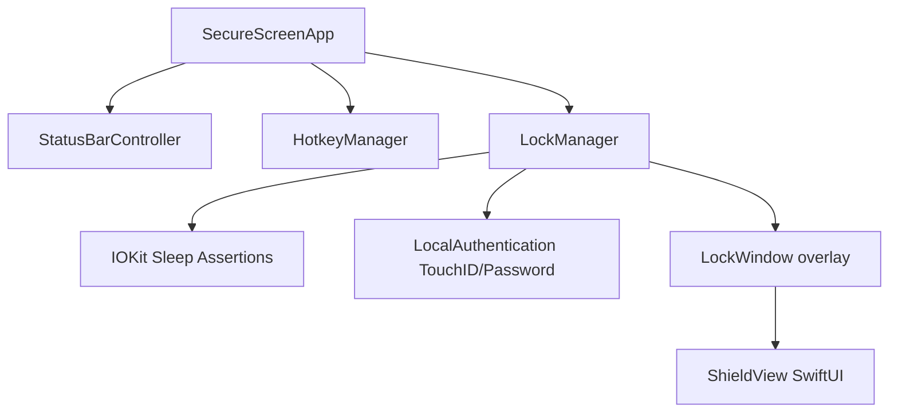

# SecureScreen Implementation Plan

SecureScreen is a utility plugin/application for macOS designed to lock the user's screen (displaying a secure, customizable translucent overlay) while preventing the system from going to sleep. This ensures that long-running background tasks—such as code compilation (e.g., Gradle builds) or autonomous AI agent runs—continue executing at full speed while the device is secured against nosy neighbors.

## User Review Required

> [!IMPORTANT]
> **Permissions Needed**:
> To capture all keystrokes and override standard system hotkeys (like Command+Tab, Command+Option+Esc) when the lock screen is active, the application will enter macOS **Kiosk Mode** (using `.disableProcessSwitching`, `.hideDock`, and `.disableForceQuit` presentation options). This does not require Root/Sudo privileges, but standard system-level API behaviors will be restricted strictly while the screen is locked.
>
> **Global Shortcut Integration**:
> We will implement global shortcuts using the standard macOS **Carbon HotKey API**. This avoids requiring the user to grant macOS Accessibility permissions (which would be required if we used `CGEventTap`).

## Core Decisions & Configurations (Aligned with User Feedback)

> [!TIP]
> 1. **Default Global Shortcuts**:
>    - **Lock Screen**: `Option + Shift + L` (⌥⇧L)
>    - **Unlock Screen**: `Option + Shift + U` (⌥⇧U) to trigger the Touch ID/Password verification.
> 2. **Translucent Lock Shield**:
>    - The lock screen overlay will be a full-screen, click-blocking window with **customizable translucency** (e.g., 1% to 50% opacity).
>    - This allows the user to see background task outputs (like terminal scrolls or logs) while preventing any keyboard, mouse, or trackpad gesture interactions from passing through.
>    - To a third person, the laptop will look like it is awake and running but hung.
> 3. **Minimal UI Overlay**:
>    - No digital clock or lock icon on the overlay window to maintain the "hung screen" illusion.
>    - A subtle, dim instruction text (e.g., "Locked: Press ⌥⇧U to Unlock") will be displayed or faded in when a keystroke or click attempt occurs.
> 4. **Status Bar Menu Controls**:
>    - provision to modify overlay translucency directly via a menu slider or presets.
>    - A **"Test Mode"** utility that runs our verification sleep-prevention script and verifies the background tasks are uninterrupted.

---

## Proposed Changes

We will create a standalone, lightweight macOS application using Swift (AppKit + SwiftUI). The project will be managed using Swift Package Manager (SPM) for clean compilation and bundled into a `.app` container via a simple build script.

### Build & Package Config

#### [NEW] [Package.swift](file:///Users/hakshaysundar/Documents/Projects/SecureScreen/Package.swift)
Swift Package Manager configuration file defining the executable target and platform requirements (macOS 14+).

#### [NEW] [build.sh](file:///Users/hakshaysundar/Documents/Projects/SecureScreen/build.sh)
A build script to:
1. Compile the Swift executable.
2. Build the `SecureScreen.app` folder structure.
3. Generate the required `Info.plist` with `LSUIElement` set to `true` (making it a background/menu bar agent app).

---

### Core Logic

#### [NEW] [main.swift](file:///Users/hakshaysundar/Documents/Projects/SecureScreen/Sources/SecureScreen/main.swift)
The main entry point for the application. Sets up the NSApplication lifecycles, initializes the status bar controller, and wires up global hotkeys.

#### [NEW] [HotkeyManager.swift](file:///Users/hakshaysundar/Documents/Projects/SecureScreen/Sources/SecureScreen/HotkeyManager.swift)
Interfaces with the macOS Carbon framework (`RegisterEventHotKey` / `InstallApplicationEventHandler`) to listen for global hotkeys (Lock/Unlock) system-wide, without requiring accessibility permissions.

#### [NEW] [LockManager.swift](file:///Users/hakshaysundar/Documents/Projects/SecureScreen/Sources/SecureScreen/LockManager.swift)
Coordinates locking and unlocking actions:
- Creates `LockWindow` instances for all active displays.
- Asserts power management assertions via `IOPMAssertionCreateWithName` to block idle system sleep.
- Enters and exits kiosk presentation mode to block Magic Trackpad space switches and Mission Control.
- Evaluates biometric/password authentication via the `LocalAuthentication` framework (`LAContext`).

#### [NEW] [LockWindow.swift](file:///Users/hakshaysundar/Documents/Projects/SecureScreen/Sources/SecureScreen/LockWindow.swift)
A borderless, full-screen `NSWindow` subclass designed to stay on `NSScreenSaverWindowLevel`. Captures all local keystrokes and mouse events to secure the screen and blocks them, preventing interactions from reaching the underlying windows.

---

### User Interface

#### [NEW] [ShieldView.swift](file:///Users/hakshaysundar/Documents/Projects/SecureScreen/Sources/SecureScreen/ShieldView.swift)
A minimal, translucent SwiftUI view displayed on the locked screen saver overlay. Features:
- Solid dark background with configurable opacity (e.g. 2% to 40%).
- Hides clock, lock icon, and other decorative elements.
- Features a small, low-contrast instruction text "SecureScreen is secured. Press ⌥⇧U to Unlock" which fades in temporarily only upon click or key presses.

#### [NEW] [StatusBarController.swift](file:///Users/hakshaysundar/Documents/Projects/SecureScreen/Sources/SecureScreen/StatusBarController.swift)
Handles the macOS system menu bar icon, providing options to:
- Lock Screen (showing ⌥⇧L).
- Translucency level slider/presets (e.g., 2%, 10%, 25%, 50%).
- "Run Integration Test..." to run the sleep-prevention diagnostic script.
- Quit the application.

---

## Verification Plan

### Automated Verification
We will write a test script to verify that locking the screen does not suspend background work:
- Run a shell script `test_sleep.sh` that appends the current timestamp to a log file every 1 second.
- Trigger the screen lock via the global shortcut.
- Wait for 30 seconds.
- Unlock the screen using Touch ID.
- Verify that the timestamp log file has no gaps or pauses in timestamps during the locked duration.
- The Status Bar Controller will feature a "Run Integration Test..." option that automates launching this test and displaying a success/failure notification when completed.

### Manual Verification
1. **Multi-monitor test**: Verify that when multiple displays are connected, all screens are covered with the security overlay.
2. **Input lock test**: Verify that standard system shortcuts (e.g., `Cmd + Tab`, `Cmd + Option + Esc`, `Ctrl + Left/Right arrow`) and trackpad swipe gestures to switch spaces are completely blocked while locked.
3. **Authentication fallback**: Verify that Touch ID works, and if biometrics are cancelled, password input is successfully presented and works.
